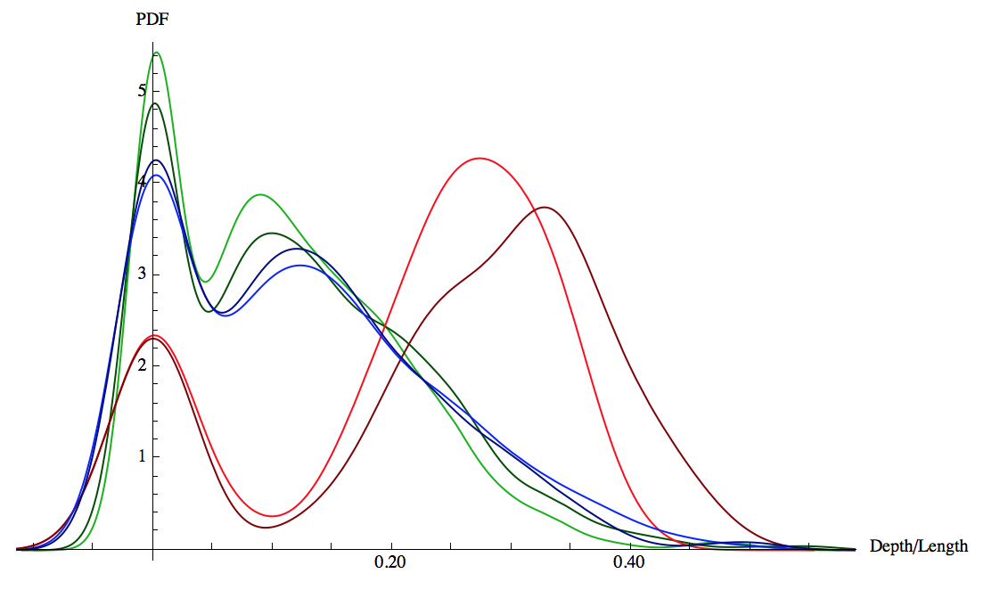

# Alignment Trees 
Vishesh Gupta

## Motivation

The primary problems in translation have always been selecting the appropriate
words to translate to (an issue of dictionary), and then rearranging them
in the most fluent way possible (the issue of alignment). 
Of the two, Alignment Trees deal with the second. 

Trivially, the ideal rearrangement is one of the possible permutations of 
the sentence. However, considering all of the permutations quickly becomes
unwieldy, mostly because there are too many variations of sentences and too
many permutations to handle. 

However, [DeKai Wu](http://delivery.acm.org/10.1145/980000/972707/p377-wu.pdf) 
and other researchers have noted that "related information
stays together" in previous research. For example, if there is "red car" in
english, it might become "autombile roja" in spanish, but the word for red
and the word for car would never be very far from each other. 

What this suggests (and follows from our own intuition of grammar) is that
there is some tree-like structure to natural language, and that some of those
subtrees have the same leaves, but in different orders. 

In that case, it should be possible to map one grammar tree to another
grammar tree (or the corresponding subtrees) and learn when those trees
are similar or different. This is generally called tree-based translation, and
there are many algorithms for it on the 
[moses tree-based translation page](http://www.statmt.org/moses/?n=Moses.SyntaxTutorial#ntoc1)

DeKai Wu et all concieved of a tree of operations that map the order of the
source language to that of the target language. 
His intuition was that these mappings could be produced by simply reordering
each pair of words, with two operations - N and R, where N preserves order
and R reverses the order. 

As an example, consider an alignment problem with the sentences "I went home" 
and "Mein ghar gaya" (phoneticized Hindi, translated to I home went).

Now, the appropriate tree here would be (N I (R went home)) to transform the
original ordering of the words to the new ordering in hindi. 

There are still issues with this approach, such as spurious words, and phrase
alignments among other problems, and I will discuss how we dealt with those.

## How To

Alignment trees are made by taking a parallel alignment problem such as 

```
english: The Government will help develop customer satisfaction indices ,  and encourage their inclusion in existing and future benchmarking schemes .
hindi: सरकार सेवाओं से उपभोक्ताओं की संतुष्टी नाँपने के पैमाने विकसित करने और इनको  वर्तमान तथा भविष्य की बैंचमार्किंग स्कीम्ज में शामिल करने के लिए मदद देगी  ।
alignment: 1-0 2-24 2-25 3-24 3-25 4-9 4-10 5-3 5-4 5-5 6-3 6-4 6-5 7-6 7-7 7-8 9-11 11-12 12-20 12-21 13-19 14-13 15-14 16-15 17-17 18-18 19-26
```

And produce a tree like 

```clojure
(:N
 (:N
  (:N
   (:N
    (:R
     (:R
      (:R
       (:N 10 11)
       (:N 8 9))
      7)
     (:N
      (:N
       (:N
        (:N
         (:N
          (:N 0 1)
          2)
         3)
        4)
       5)
      6))
    12)
   13)
  (:R
   (:R
    (:R
     (:R
      (:R 23 22)
      (:N 20 21))
     (:N 18 19))
    17)
   (:N
    (:N 14 15)
    16)))
 24)
```

Here's the flattened (simplified) version of this tree:

```clojure
(:N
 (:N
  (:R
   (:R
    (:N 10 11)
    (:N 8 9)
    7)
   (:N 0 1 2 3 4 5 6))
  12
  13)
 (:R
  (:R
   (:R
    (:R 23 22)
    (:N 20 21))
   (:N 18 19)
   17)
  (:N 14 15 16))
 24)
```

This is clojure syntax (edn format) for the tree where :N is the normal operation
and :R is the reverse operation. 

It may be easier to see this as a operation tree as an actual tree 
[online](http://ling-itgp.herokuapp.com/hi/13).

As you can see, taking the leaf nodes in their original order (as given on the
right of the picture) and then applying the operations as you go up the tree
would take the out of order leaf nodes and put them back in order 0-whatever.

So this tree represents a series of operations that can reorder a tree from one
language to another. 

It's much easier to visually understand if you go to the 
[website](http://ling-itgp.herokuapp.com).
Pressing right/left moves you around the different sentences, and you can 
choose between french, hindi and swedish.

One thing to note is that the only required input to the tree-generation
is the alignment string. In other words, this problem can take a string like
'0-0 1-10 2-3 4-9 ...' and output a tree of operations. From here on out,
we will only showcase those strings and trees, not deal with the original
words of the sentences.

Another visual presentation of this is given in these 
[slides](https://docs.google.com/presentation/d/1NHC_teV0lUH_AUVZpk2JUzwP1myVwXXXAFRsnDe-8R0)
Play through slides 5-8 to get a picture of how an alignment produces an 
alignment tree.

## Inconsistencies

As it was stated before, there are some issues with generating these trees.
Here's a list of them, and how we got around the problems. 

### One-to-many mapping

Here we'd get a string like '1-1 1-2 1-3'. 
The way to think about this is that some word in one language maps to a 
phrase in another language. In the situations where there was a contiguous 
mapping (like in the example given) it was easy to just shrink down the phrase
in the target language to one terminal (let's just replace 1,2,3 by 1) and 
then you'd have '1-1' in the alignment string. This is pretty much the intent
of a contiguous one-to-many mapping anyway - the three words it produces
are pretty much one entity.

This gets more confusing with things like split infinitives, when you might 
see an alignment like '1-1 1-3 2-2'. Now it's impossible to "shrink" the 
mapping since the phrase is split around another word.

The solution we came up with is to duplicate the original word (ie., the 
two 1's are separate entities), which would give you a tree like `(N 1 (R 3 2))`

For the purposes of identifying these numbers differently, we would uniquely 
number the 1's. So the new string would be '1-1 2-3 3-2', and the corresponding
tree would be `(N 1 (R 3 2))` with no hassle.

This seems strange, but it's actually a well known tactic in the
generative stories of IBM model 3. 

### Vanishing words (one-to-no mapping)

Basically the string looks like '1-1 3-2' and 2 doesn't go anywhere. 
The solution we came up with was to copy the previous word's alignment (i.e
fold the non-producing word left).

This isn't the greatest way to do this (and I have some ideas
on how to improve the folding). In many languages (english included) it 
actually makes more sense to fold right (hindi is a good example - heads always
come after their modifiers. This is also true of english 
(i.e, the red car -> lal gadi, but you'd want to fold 'the' right so that
it grammatically comes under the clause it's actually part of)). It really 
depends on which word is being left out of the mix.

In our current solution, you'd get a new alignment string like '1-1 2-1 3-2'.

An issue is that the parse tree gets an
extra terminal for 2 that didn't exist in the original alignment. 

We actually don't create a new terminal for this reason, and just renumber
the old terminals. So we get '1-1 2-3' -> '1-1 2-2' (and we pretend that
word #2 doesn't exist.)

This is actually a bad idea, since it removes information about null alignments.
It would be helpful to know that, for example '[a|an|the] noun -> noun' in hindi
in almost all cases (hindi doesn't have articles)

### Many to one mappings

This is the opposite of one-to-many. 

In this case, we duplicate the terminal in the target languge, and get
'1-1 2-1 3-2' -> '1-1 2-2 3-3' and it parses to `(N 1 (N 2 3))`.

### Materializing words

This is the target side version of the vanishing words.
Again, we just fold the non-aligned words into the previous terminal.

Again, this is problematic, because you may want to fold right in many 
languages. 

So '1-1 2-3' would become '1-1 1-2 2-3' which would become '1-1 2-2 3-3' 
per previous rules. We end up with `(N 1 (N 2 3))`.

### Higher order operations. 

Try parsing '2 4 1 3' with only N and R operations. 
You can't.

The solution to this is to allow higher order operations where needed.
They tend to be rare ('2413' and '3142' are the only two length-4 ones,
there are 6 length-5, and 46 length-6 ones). If you're curious, this corresponds
to the sequence A111111 in the integer sequences dictionary, and it actually
has a very beautiful mathematical interpretation as A(n) = # of simple permutations
of length n. This makes a whole lot of sense, since one would have to consider
the entire sequence's permutation to reverse it back to the original order.

The next few numbers in the sequence are 338 and 2926. It's really hard to 
imagine that our minds are dealing with 2926 different permutations of things
when we construct sentences, rather than dealing with 46. I've cut off the 
operations at order 6, and anything larger, I'm attributing to a faulty 
alignment, or there's something bizarre going on. 

### phrase translations.

Unfortunately, there are lot of shortcuts taken in the data, and one of them
are wholesale phrase translations. There are a lot that aren't what I'd call
"minimal", and they tend to contain more words than they need to.
[Here's](http://ling-itgp.herokuapp.com/fr/19) a good example, if you look
at the end of the sentence. It's non minimal because there are a lot of direct
translations you could map out of that set, and because 'in' is mapped to 
two separate phrases next to each other. This is a super bizarre example, and
I wasn't able to parse this alignment. I'd say whoever made it was a little
confused, but I don't speak french so it's hard for me to verify.

This normally looks like '1-1 1-2 1-3 2-1 2-2 2-3'. Basically a series of
two words in the source maps to a series of three words in the translation.

The way that I'm dealing with this is to collapse the phrases on both sides
to a single terminal. So we get '1-1' only in this case, since it's one 
phrase to one phrase. 


## Now what?

So we have the trees, and we can parse alignments. 


There are a couple problems that are of interest here. 

The first is language detection. This isn't really helpful in the sense of
solving language detection itself, since you need an alignment (and
presumably if you're generating that, you already know what language you're
dealing with), but being able to identify which language is being translated
would be a good sanity check against the known linguistic phylogenic tree 
(i.e, languages far apart should be easy to tell apart, and languages close
together would be harder to tell apart). 
It could also be useful to do language detection as a sort of sanity check - 
if you are attempting to do an alignment and the language detection thinks
you're in another language altogether, then there's a very, very low probability
that your alignment is correct. This could, for example, be an indicator 
feature in Phrasal (ie.: alignment matches translation pair?)

The second is looking at translation itself. We could either try improving 
phrase-based translation by giving the probability that some sequence of tokens
aligns the way that it does, or we could go or tree-based alignment models, 
which generate a set of grammar rules that are used to parse/generate a sentence.

## Future Directions/TODOS

### Code fixups

We really need to fixup the code so that there isn't so much duplication, and
get ourselves into a standard toolset. There's a lot of copy-pasting I did 
to try and keep things as small scripts, which we can remove.

### Adding POS tags, or raw terminals themselves.

Moses' tree based algorithms use the actual words themselves when trying to 
generate rules. That could be a bit much considering our corpora sizes (we
either need to run an aligner, generate alignments, use those alignments to 
bootstrap our model, or stick to the test sets of standard alignment problems
as the data for our problem).

A good intermediate would be POS tags. Simply looking at the subtrees with
no distinguishing terminals seems rather weak. The only feature you get there
is the number of terminals, which doesn't seem like it would help very much. 

Here's what that looks like. To get this output, run 
`treegeneration.py -l word-alignment-data/English-Hindi.test/english-hindi.alignment | subtrees | sort | uniq -c | sort -n`
from the main directory.

```clojure
   2 (:N (:N (:N (:N (:N (:N (:N (:N * *) *) *) *) *) *) *) *)
   2 (:N (:N (:N (:N (:N (:N (:N * *) *) *) *) *) *) *)
   2 (:N (:N (:N * *) *) (:R (:R (:R * *) *) (:N (:N * *) *)))
   2 (:N (:N (:R (:N * *) *) *) *)
   2 (:N (:R (:N * *) *) *)
   2 (:N (:R * *) *)
   2 (:N * (:R (:N * *) (:N * *)))
   2 (:N * (:R (:R (:R * *) *) *))
   2 (:R (:N (:N (:N * *) *) *) (:N * *))
   2 (:R (:N (:N * *) *) (:N * *))
   2 (:R (:R (:N (:N * *) *) *) (:N * *))
   2 (:R (:R (:N * *) (:N (:N * *) *)) *)
   2 (:R (:R (:R * *) *) (:N (:N * *) *))
   2 (:R (:R * (:N * *)) (:N (:N * *) *))
   2 (:R (:R * (:N * *)) *)
   2 (:R * (:N (:N (:N * *) *) *))
   3 (:N (:N * *) (:R (:N * *) *))
   3 (:N * (:R * (:N (:N * *) *)))
   3 (:R (:N (:N * *) *) (:N (:N * *) *))
   3 (:R (:N * *) (:N (:N (:N * *) *) *))
   3 (:R (:R (:N * *) (:N * *)) (:N * *))
   3 (:R (:R * (:N (:N * *) *)) *)
   3 (:R (:R * *) (:N * *))
   4 (:R (:N (:N (:N * *) *) *) *)
   4 (:R (:R (:N * *) *) (:N * *))
   5 (:R (:R (:N (:N * *) *) *) *)
   6 (:R (:R (:R * *) *) *)
   7 (:N (:N (:N (:N (:N (:N * *) *) *) *) *) *)
   7 (:R (:N * *) (:N (:N * *) *))
   9 (:R (:R (:N * *) *) *)
   9 (:R (:R * *) *)
  11 (:N (:N (:N (:N (:N * *) *) *) *) *)
  11 (:R (:N (:N * *) *) *)
  11 (:R * (:N (:N * *) *))
  12 (:R * (:N * *))
  14 (:R (:N * *) (:N * *))
  20 (:N (:N (:N (:N * *) *) *) *)
  24 (:R * *)
  26 (:R (:N * *) *)
  43 (:N (:N (:N * *) *) *)
 123 (:N (:N * *) *)
 269 (:N * *)
```

This is the English-Hindi test data, which has 90 examples, and is really
not large enough to have anything much specific. Even then, this isn't very
interesting to look at, and I doubt that this means much without some more
interesting terminal descriptions than "we don't care what's here".

### Depth

One interesting feature that I came up with is called depth. If you want to
compute depth for each tree, just run `... | flatten | awk 'BEGIN{FS="("} {print NF}'` where ... is whatever generates the trees. 

Depth tells you how "complex" the alignment tree is. For something like french,
the flattened tree generally has depth 1 (meaning there's just one :N and 
everything is already in the order that it needs to be.), at all lengths.

For something like Hindi, the depth is higher, on the order of 4 deep/word 
when the sentence is longer than 5 terminals. 

Normalizing by the length of the sentence gives you a pretty stable metric to 
determine which language you're dealing with (of course, you could just
include both depth and length as features and fit in 2-D space).

Here's what d/L looks like:


green is swedish, blue is french, and red is hindi. 

We're already seeing some nice differences! The spikes at 0 come from very short
examples, most of which are just phrases that translate directly anyway.
